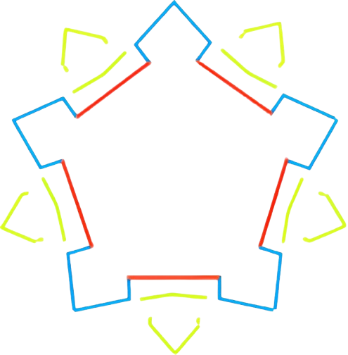

[](LICENSE)
[](https://reactjs.org/)

# Fort Vauban Generator

## Description

The Fort Vauban Generator is an interactive web application that allows users to create and customize virtual representations of Vauban-style fortifications (military structures designed by Sébastien Le Prestre de Vauban in the 17th century). The application generates dynamic SVG visualizations based on user input.

Users can adjust various parameters such as size, shape, and design style to generate unique fort configurations.

## Technical Design Model

The fort generation is based on geometric principles used in authentic Vauban fortifications. Below is the reference model that guides the mathematical calculations in our generator:



*Reference: This geometric model is based on historical fortification principles as described in [La géométrie des fortifications de Vauban](https://blogs.futura-sciences.com/lehning/2019/01/24/la-geometrie-des-fortifications-de-vauban/) (The Geometry of Vauban Fortifications).*

## Features
- Interactive controls for adjusting fort parameters (bastions, extensions, colors)
- Multiple design themes (including Neumorphism, Glassmorphism, Brutalism, and more).
- Responsive design for optimal viewing on different devices.
- Preset configurations for quick setup and inspiration
- Real-time visual updates as parameters are adjusted

## Installation

1. Clone the repository:
   ```
   git clone [URL]
   ```

2. Navigate to the project directory:
   ```
   cd fort-vauban-generator
   ```

3. Install the dependencies:
   ```
   npm install
   ```

## Usage

1. Start the development server:
   ```
   npm start
   ```

2. Open your browser and go to `http://localhost:3000` to view the application.

3. Use the control panel to customize your fort:
   - Adjust the bastion orientation
   - Select from various design styles
   - Apply presets for quick configuration

4. To build for production:
   ```
   npm run build
   ```

## Contributing
Contributions are welcome! Please open an issue or submit a pull request for any enhancements or bug fixes.

## Future Enhancements
- Save and export fort designs
- Additional fort elements and customization options
- Historical information about Vauban fortifications
- Colors customisations of forts elements
- 3D visualisations

## About This Project

This is my first React project, created as a hands-on learning experience to discover fundamental React concepts. Through this development process, I've explored multiple technologies, frameworks, and development environments while building a practical application.

## License
This project is licensed under the MIT License. See the LICENSE file for more details.
